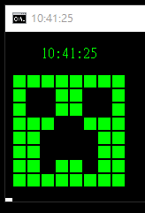

2017.06.12

# 苦力怕時鐘 (Creeper Clock)

## 介紹
**苦力怕時鐘** 是一個使用 Windows 批次檔 (`.bat`) 撰寫的簡單時鐘，特色是以 Minecraft 中的 **苦力怕 (Creeper)** 臉部圖案作為動畫顯示，並每秒更新一次時間。它能在命令提示字元 (`cmd`) 內運行，適合用來作為有趣的桌面時鐘。

## 功能特色
- 顯示當前系統時間 (`HH:MM:SS`)，並每秒刷新。
- 使用 **綠色 (`color a`)** 呈現螢幕，以符合 Minecraft 苦力怕的經典配色。

